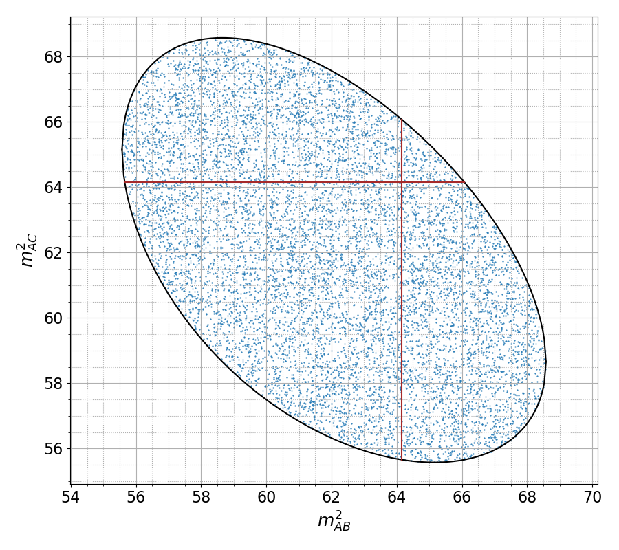

# NuclearDalitz

Package for illustrative diagram drawing for the `C12` decaty to three alpha particles. Script `dalitzplot.py` can be called with two concole parameters:

```sh
pip install -r requirements.txt
python dalitzplot.py [mass C12] [mass resonance]
```

A plot like shown below is produced:

